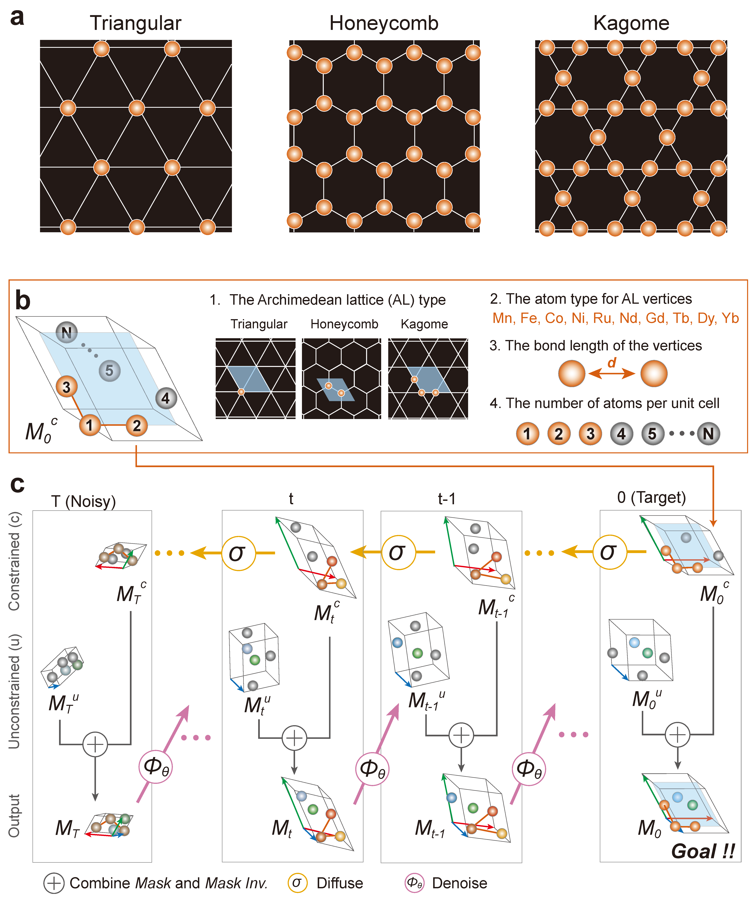

# APS Tutorial T4: Generative AI for Physics — From Models to Materials


## What is this tutorial?

This tutorial teaches you how to **generate new crystal structures** using diffusion models — from foundational concepts to hands-on generation and evaluation. You will:

1. Understand how crystal structures are represented for machine learning
2. Train a diffusion model (DDPM) on MNIST to build intuition
3. See how diffusion extends to periodic crystal structures (DiffCSP)
4. Generate materials with targeted lattice geometries using **SCIGEN**
5. Evaluate generated structures with machine-learning interatomic potentials (CHGNet)

Everything runs in **Google Colab** — no local setup required.

### Background: SCIGEN

**SCIGEN** (Structural Constraint Integration in GENerative model) is a diffusion-based framework that generates crystal structures with targeted geometric patterns — kagome, honeycomb, triangular, and more. Published in [*Nature Materials* (2025)](https://doi.org/10.1038/s41563-025-02355-y).

<p align="center">
  
</p>

The published pipeline generated **10 million candidate structures**, screened to **24,743 DFT-validated materials** — including novel kagome magnets, honeycomb topological candidates, and frustrated lattice compounds.

---

## Tutorial Outline

| # | Notebook | What you'll learn | Time |
|---|----------|-------------------|------|
| 00 | [**Setup**](notebooks/00_setup.ipynb) | GPU check, install dependencies, download pretrained model | ~5 min |
| 01 | [**Crystal Structures**](notebooks/01_crystal_structures.ipynb) | pymatgen, (L,X,A) representation, MP-20 dataset, kagome lattice, tight-binding bands | ~15 min |
| 02 | [**Generative Concepts**](notebooks/02_generative_concepts.ipynb) | DDPM theory, train on MNIST, classifier-free guidance, connection to materials | ~15 min |
| 03 | [**Diffusion for Materials**](notebooks/03_diffusion_materials.ipynb) | DiffCSP, wrapped normal for periodic coordinates, forward/reverse process visualization | ~15 min |
| 04 | [**SCIGEN Generation**](notebooks/04_scigen_generation.ipynb) | Constrained generation (kagome, honeycomb, ...), trajectory visualization, XRD, distribution analysis | ~20 min |
| 05 | [**MLIP Evaluation**](notebooks/05_mlip_evaluation.ipynb) | CHGNet predictions, structure relaxation, phonons, convex hull, screening pipeline | ~15 min |

**Total: ~90 minutes** (with hands-on Colab work)

### Open in Colab

| Notebook | Link |
|----------|------|
| 00 Setup | [](https://colab.research.google.com/github/RyotaroOKabe/APS_demo_SCIGEN/blob/main/notebooks/00_setup.ipynb) |
| 01 Crystal Structures | [](https://colab.research.google.com/github/RyotaroOKabe/APS_demo_SCIGEN/blob/main/notebooks/01_crystal_structures.ipynb) |
| 02 Generative Concepts | [](https://colab.research.google.com/github/RyotaroOKabe/APS_demo_SCIGEN/blob/main/notebooks/02_generative_concepts.ipynb) |
| 03 Diffusion for Materials | [](https://colab.research.google.com/github/RyotaroOKabe/APS_demo_SCIGEN/blob/main/notebooks/03_diffusion_materials.ipynb) |
| 04 SCIGEN Generation | [](https://colab.research.google.com/github/RyotaroOKabe/APS_demo_SCIGEN/blob/main/notebooks/04_scigen_generation.ipynb) |
| 05 MLIP Evaluation | [](https://colab.research.google.com/github/RyotaroOKabe/APS_demo_SCIGEN/blob/main/notebooks/05_mlip_evaluation.ipynb) |
| Standalone Quick-Start | [](https://colab.research.google.com/github/RyotaroOKabe/APS_demo_SCIGEN/blob/main/notebooks/tutorial_colab.ipynb) |

> **Start with Notebook 00**, then work through in order. Each notebook builds on the previous ones, using **kagome-lattice materials** as a running example.

---

## The Big Picture

```
Crystal structures (L, X, A)          NB 01
        |
        v
Diffusion models (DDPM)               NB 02
        |
        v
Crystal diffusion (DiffCSP)           NB 03
   - Wrapped normal for periodic coords
   - Predictor-corrector sampling
        |
        v
Constrained generation (SCIGEN)       NB 04  <-- capstone
   - Guarantee kagome/honeycomb sites
   - Model generates complementary atoms
        |
        v
MLIP evaluation (CHGNet)              NB 05
   - Energy, forces, phonons
   - Convex hull stability screening
        |
        v
Candidates for DFT & synthesis
```

**Key tools used in this tutorial:**
- [DiffCSP](https://github.com/jiaor17/DiffCSP) — Jiao *et al.*, *NeurIPS* (2023)
- [CHGNet](https://github.com/CederGroupHub/chgnet) — Deng *et al.*, *Nature Machine Intelligence* (2023)
- [pymatgen](https://github.com/materialsproject/pymatgen) — Ong *et al.*, *Comput. Mater. Sci.* (2013)
- [DDPM on MNIST](https://github.com/TeaPearce/Conditional_Diffusion_MNIST) — TeaPearce (MIT License)

### Dataset

SCIGEN-generated materials (10.06M candidates, 24,743 DFT-validated) are available on Figshare:
[https://doi.org/10.6084/m9.figshare.c.7283062](https://doi.org/10.6084/m9.figshare.c.7283062)

---

## Contact

Questions or issues? Open an issue on this repository or contact Ryotaro Okabe (rokabe [at] mit [dot] edu).
